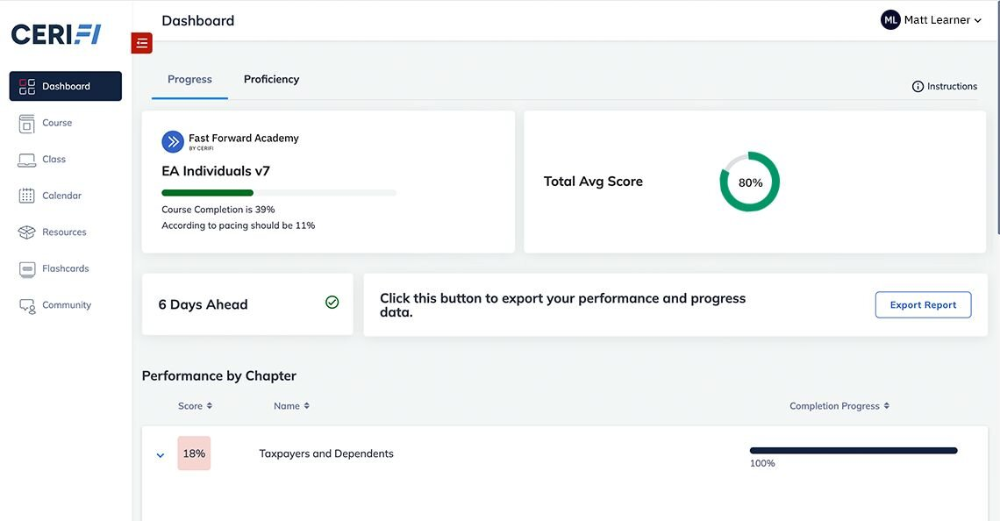
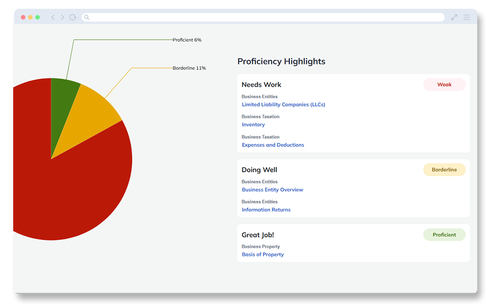
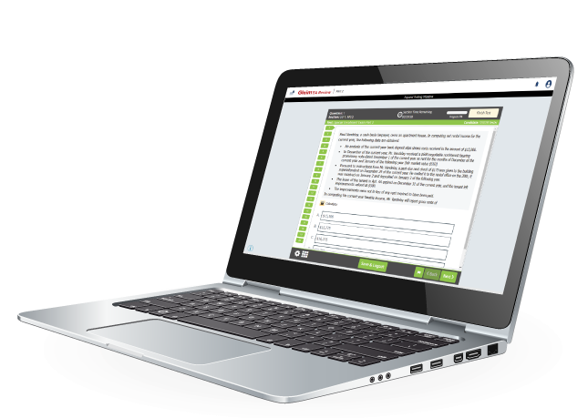

Learning that moves you forward.
Our innovative platform empowers tax professionals to grow with confidence—smarter, faster, and fully equipped for what’s next.

----

Expert Instruction
The foundation of a great course is expert instruction and content. We organize the most important exam topics in a clear and efficient way, allowing you to focus on what you must know to pass the test.

Powerful Technology
We’ve refined our personalized learning technology to enhance every aspect of your study experience. Our proprietary  delivers an intuitive, data-driven platform tailored to your needs—offering powerful insights and tools you won’t find anywhere else.

Unparalleled Support
Self-study doesn’t mean you’re alone—we’re your partner in success, in your corner every step of the way. Whether you need guidance, motivation, or quick answers, we’re here to help. Give us the opportunity, and we’ll go above and beyond to exceed your expectations.

----

Enrolled Agent Exam Prep

Prepare for your career with our EA Prep Course
Get a professional credential with our industry-leading EA exam preparation methods. Online adaptive learning promises a more efficient study experience, but few providers deliver real value. Our approach empowers data-driven decision-making and sets you up for success.

----

We make it easier.
Every function and feature of our learning platform is designed to make studying for the Enrolled Agent Exam as easy as possible. Because let’s face it—half the challenge of studying is figuring out how you learn best. we gives you the tools to study smarter, stay on track, and feel confident when test day arrives.d

Easier to learn
Intuitive, side-by-side design of our platform ensures all of your learning resources are accessible with a simple click.



Easier to Focus
Know where to invest your time — Track your confidence in each topic with our advanced performance analysis tools.



Easier to connect
​Engage with instructors and fellow learners in the platform — Get clarity on difficult topics or celebrate a passing score with your peers!

Easier to succeed
​With top-tier instruction, cutting-edge technology, and exceptional support, you’ll be on the fast track to EA exam success.​

----
Personalized Learning
Pinpointing strengths and weaknesses is key to success. Our real-time analytics personalize learning with tailored recommendations, helping each student focus on what matters most.

User-Friendly Design
Complex subjects don’t have to mean a complicated experience. We ensure students have the best tools and an intuitive platform that makes learning as smooth as possible.

----
What everyone is saying...
See why candidates trust we for their exam prep. Hear from real customers who’ve mastered key concepts, built confidence, and successfully earned their Enrolled Agent credential—ready to advance their careers.

"I used FFA for the EA exam after becoming frustrated with GLEIM and fell in love with the adaptive software. FFA software and overall system is a large part of the reason I am an EA today. Thank you!" Kenneth M.

"I was able to pass all 3 exams within my desired timeframe, all while working full-time and becoming a first-time mom! FFA is a wonderful prep course. The mentors were always available whenever you had challenges or have a question." Sarah L.

"I like the community because it helps give me more detail on the already great explanations. Notes feature was also helpful in giving me a way to recall info for future study." Amanda S.

----
The Gleim Methodology
What we do sets us apart.
Our materials are structured to help you improve and turn every mistake into a learning opportunity. Every question in our course has explanations for both right and wrong answers because we want you to understand the concepts behind the questions. Our approach has been vetted by authors with prestigious university careers—passionate educators who have spent their lives training new generations of tax professionals
You’ll learn quickly, but more importantly, you’ll build a deep understanding of the topics that will serve you throughout your tax career.

Adaptive Technology
Know what to study. Know how to study it.
You don’t just get the best materials. You get industry-leading tools and features that guarantee you a passing score.  our adaptive online platform, is your personal exam tutor. It evaluates your performance, guides you to the resources you need, and adjusts as your quiz scores improve. even tells you when you’re ready to take your exam.

Realistic Exam Environment
Don’t just build knowledge. Build confidence.
The best way to build your confidence is to get familiar with the Prometric testing environment you’ll encounter on test day. All of our questions match the exam, but the full-length mock exams built into the course give you an authentic test-day experience. Our mock exams reproduce everything, from the look and length of the test to the weighting of the topics, exactly like you’ll encounter on the real EA exam. When you’re finished, any topics you still need to brush up on will be emphasized in your personalized Final Review so you can be fully confident on exam day!
